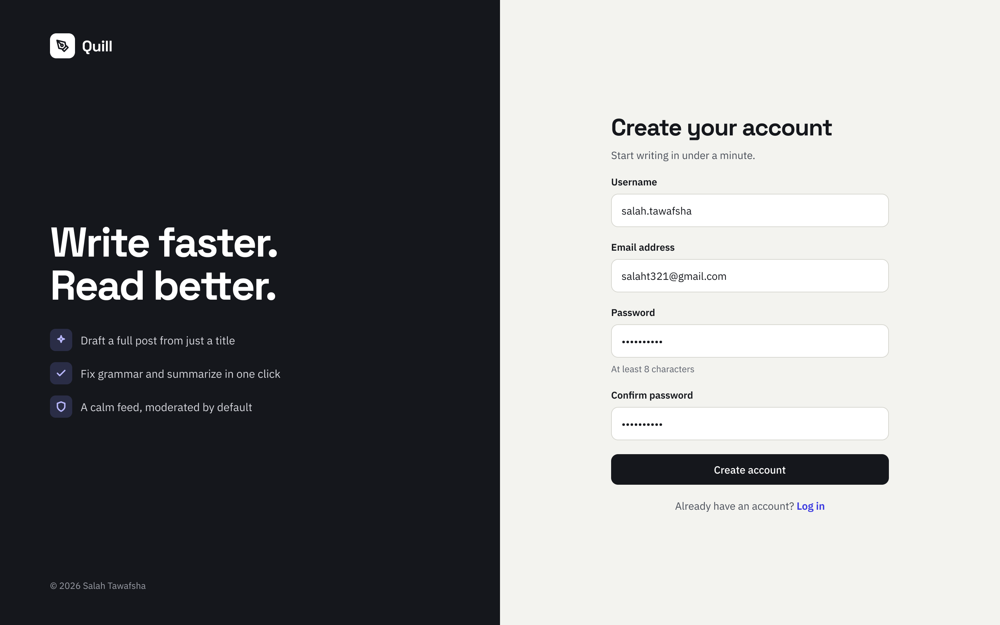
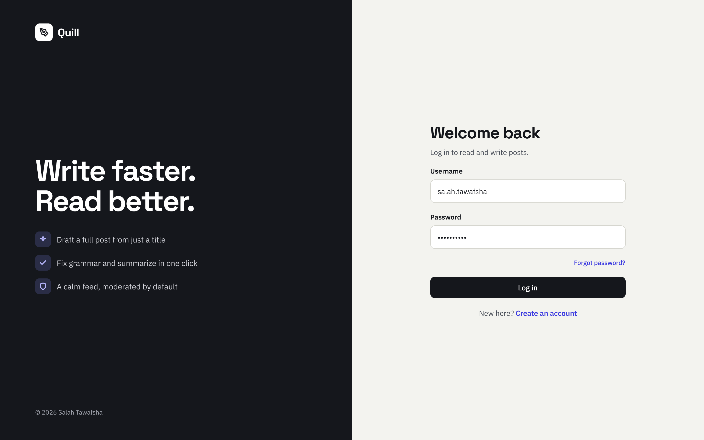
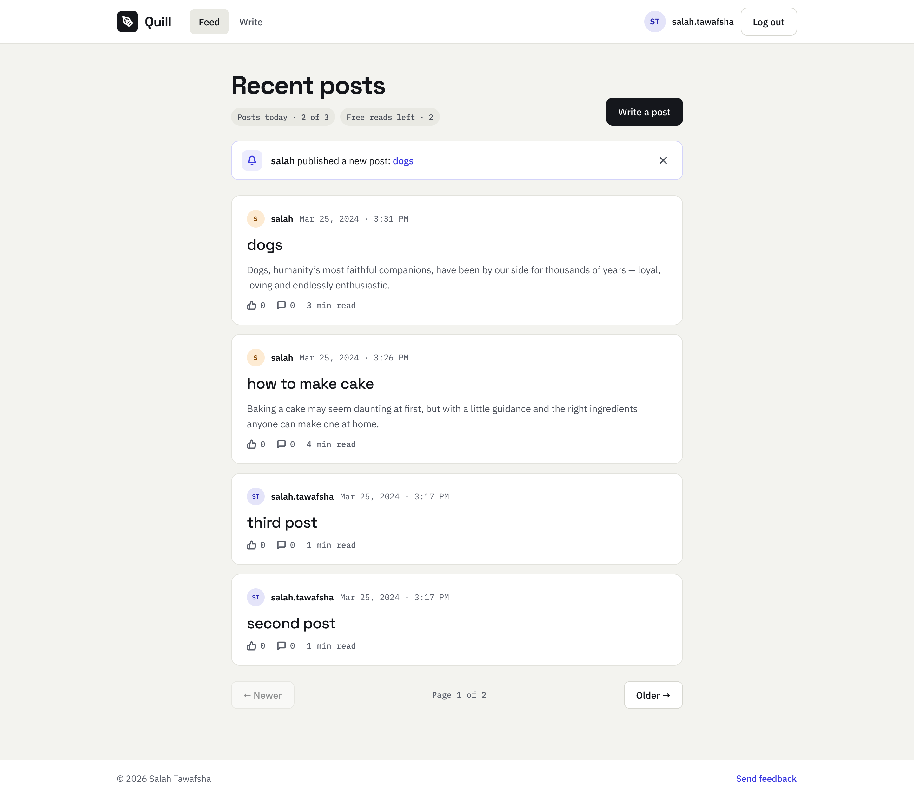
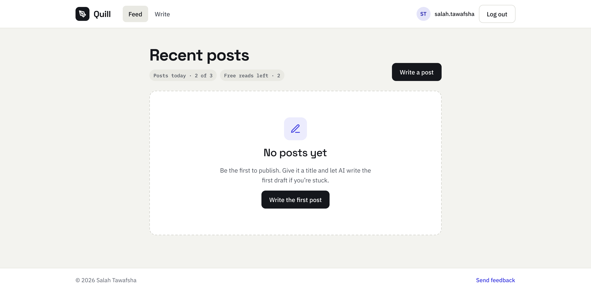
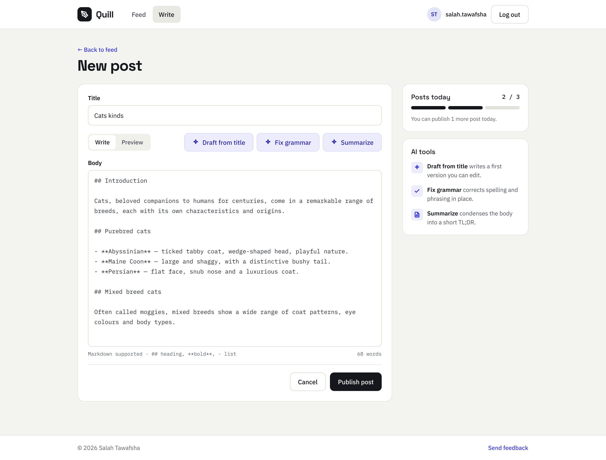
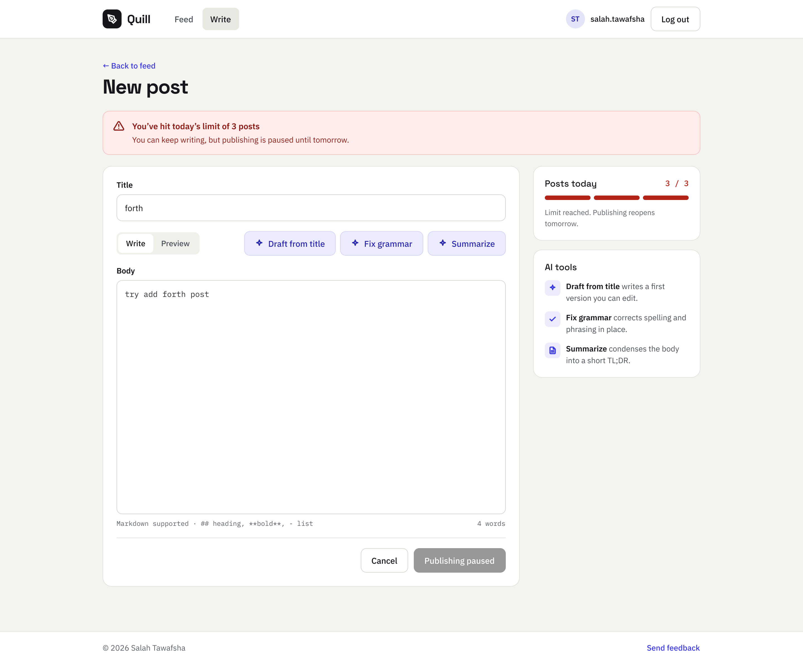
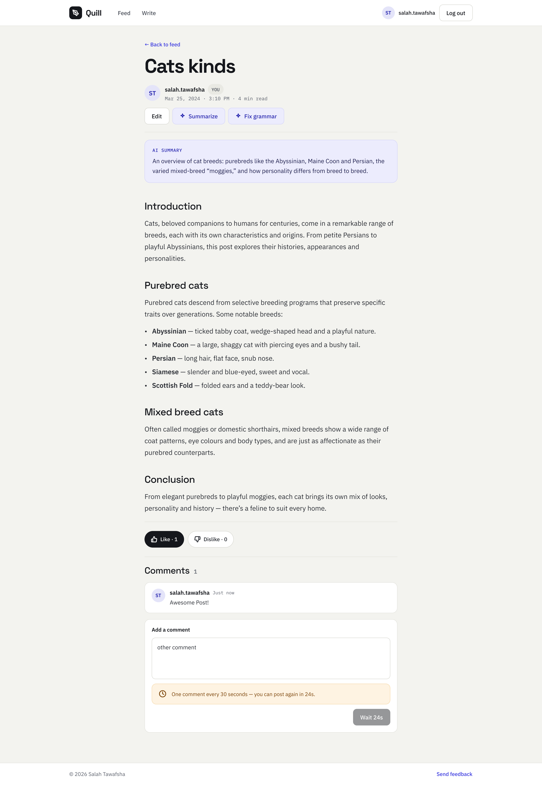
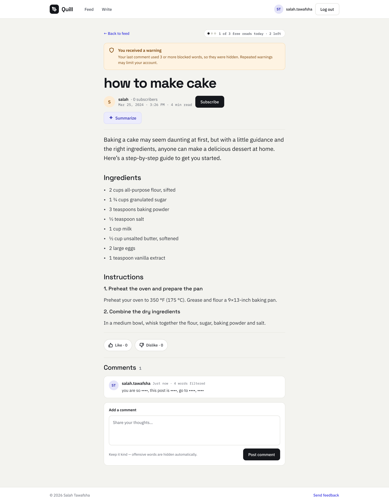

# Blog website
Website with Django framework that is blog with ability to post, subscribe
user’s channels, show posts and interact with posts

## Installation
```bash
git clone https://github.com/SalahTawafsha/blog-website-by-Django.git
pip install -r requirements.txt
py manage.py migrate
```

## Blog features
- Login and register by django authentication
- User can post and edit post
- each post has a slug to show it in url
- User can just post 3 posts per day
- User can subscribe to other users
- User receive notification when subscribed user post
- User can comment on posts once in 30 seconds to prevent spamming bots
- User can use chat gpt-3 to generate post
- User can use chat gpt-3 to summarize post
- User can use chat gpt-3 to fix grammar of post
- User can read 3 posts per day from the blog
- if user post or comment contains bad words it will be hidden by *** from other users
- if user post or comment contains more than 3 bad words he will receive warning
- if user received 3 warnings his account will be blocked for posting and comment for 10 days
- paging for posts with 4 posts per page
- APIs for functionality of the website

## Usage
```bash
py manage.py runserver
```

## Screenshots

### Sign up


### Login


### Home screen

- the header shows how many posts you published today and how many free reads are left
- when a subscribed user creates a post, a notification shows at the top of the feed
- we can click on the title to show the post, or on the close button to delete the notification
- each page has 4 posts, and we can control paging from the buttons at the bottom

### Home screen with no posts


### Create post

- we can just enter a title, then click on Draft from title to let GPT write the body
- Fix grammar and Summarize work on the body
- the side card shows how many posts are left today

### Try to add a fourth post on the same day


### Own post

- we can edit, summarize or fix the grammar of the post
- we can like, dislike and comment
- a new comment can be added only 30 seconds after the last one

### Not owned post

- we can see how many posts we visited today (just three posts are allowed per day)
- we can subscribe to the user to see their posts
- a comment with more than three bad words gives the user a warning at the top of the page, and the bad words are hidden
